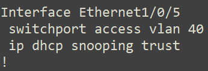
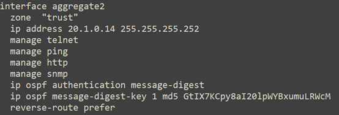
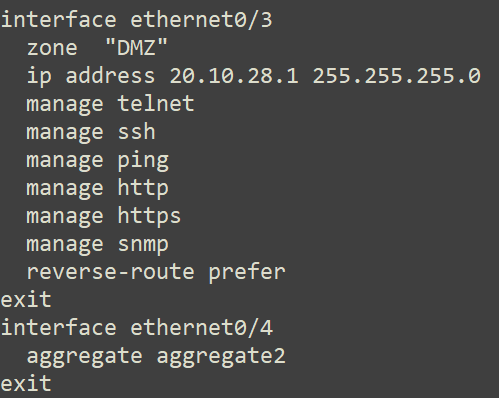

# SW

### ### 1、SW和AC开启telnet登录功能，telnet登录账户仅包含“ABC4321”，密码为明文“ABC4321”，采用telnet方式登录设备时需要输入enable密码，密码设置为明文“12345”。

### ### 2、北京总公司和南京分公司租用了运营商两条裸光纤，实现内部办公互通。一条裸光纤承载公司财务部门业务，一条裸光纤承载其他内部业务。使用相关技术实现总公司财务段路由表与公司其它业务网段路由表隔离，财务业务位于VPN 实例名称CW 内，总公司财务和分公司财务能够通信，财务部门总公司和分公司之间采用RIP路由实现互相访问。（5分）

 

  

### ### 3、尽可能加大总公司核心和出口BC之间的带宽。

### ### 4、为防止终端产生MAC地址泛洪攻击，请配置端口安全，已划分VLAN41的端口最多学习到5个MAC 地址，发生违规阻止后续违规流量通过，不影响已有流量并产生LOG 日志；连接PC1 的接口为专用接口，限定只允许PC1 的MAC 地址可以连接。

### ### 5、在总部核心交换机端口ethernet1/0/6上，将属于网段20.1.41.0内的报文带宽限制为10M比特/秒，突发值设为4M字节，超过带宽的该网段内的报文一律丢弃。

### ### 6、在SW上配置办公用户在上班时间（周一到周五9:00-17:00）禁止访问外网，内部网络正常访问。

#show clock          show acl        show tim

#vcal绑定vlan

### ### 7、总公司SW交换机模拟因特网交换机，通过某种技术实现本地路由和因特网路由进行隔离，因特网路由实例名internet。

### ### 8、对SW上VLAN50开启以下安全机制。业务内部终端相互二层隔离；14口启用环路检测，环路检测的时间间隔为10s，发现环路以后关闭该端口，恢复时间为30分钟，如私设DHCP服务器关闭该端口，同时开启防止ARP网关欺骗攻击。

# iso

  

### *** 9、配置使北京公司内网用户通过总公司出口BC访问因特网，分公司内网用户通过分公司出口FW访问因特网，要求总公司核心交换机9口VLAN41业务的用户访问因特网的流量往反数据流经过防火墙在通过BC访问因特网;防火墙untrust1和trust1开启安全防护，参数采用默认参数。

### ### 10、为了防止DOS攻击的发生，在总部交换机vlan50接口下对MAC、ARP、ND表项数量进行限制，具体要求为：最大可以学习20个动态MAC地址、20个动态ARP地址、50个NEIGHBOR表项。

### *** 11、总公司和分公司今年进行IPv6试点，要求总公司和分公司销售部门用户能够通过IPV6相互访问，IPV6业务通过租用裸纤承载。实现分公司和总公司ipv6业务相互访问；AC与SW之间配置静态路由使VLAN50与VLAN60可以通过IPv6通信；VLAN40开启IPV6，IPv6业务地址规划如下：

### ### 12、在总公司核心交换机SW配置IPv6地址，开启路由公告功能，路由器公告的生存期为2小时，确保销售部门的IPv6终端可以通过DHCP SERVER 获取IPv6地址，在SW上开启IPV6 dhcp server功能,ipv6地址范围2001:da8:50::2-2001:da8:50::100。

### ### 13、在南京分公司上配置IPv6地址，使用相关特性实现销售部的IPv6终端可自动从网关处获得IPv6无状态地址。

###   15、分公司销售部门通过防火墙上的获取IP地址，server IP地址为20.0.0.254，地址池范围20.1.60.10-20.1.60.100，dns-server 8.8.8.8。

### ### 16、如果SW的11端口的收包速率超过30000则关闭此端口，恢复时间5分钟；为了更好地提高数据转发的性能，SW交换中的数据包大小指定为1600字节；

### ### 17、为实现对防火墙的安全管理，在防火墙FW的Trust安全域开启PING,HTTP，telnet，SNMP功能，Untrust安全域开启SSH、HTTPS功能，snmp服务器地址：20.10.28.100，团体字：skills。

### ### 18、在分部防火墙上配置，分部VLAN业务用户通过防火墙访问Internet时，复用公网IP： 202.22.1.3、202.22.1.4；保证每一个源IP 产生的所有会话将被映射到同一个固定的IP 地址，当有流量匹配本地址转换规则时产生日志信息，将匹配的日志发送至20.10.28.10 的UDP 2000 端口；

### *** 19、远程移动办公用户通过专线方式接入分公司网络，在防火墙FW上配置，采用SSL方式实现仅允许对内网VLAN 61的访问，端口号使用4455，用户名密码均为ABC4321，地址池参见地址表；

### ### 20、分公司部署了一台WEB服务器ip为20.10.28.10，接在防火墙的DMZ区域为外网用户提供web服务，要求内网用户能,ping通web服务器和访问服务器上的web服务（端口80）和远程管理服务器（端口3389），外网用户只能访问通过防火墙外网地址访问服务器web服务。

### ### 21、为了安全考虑，无线用户移动性较强，访问因特网时需要在BC上开启web认证，采用本地认证，密码账号都为web4321。

### ### 22、由于分公司到因特网链路带宽比较低，出口只有200M带宽，需要在防火墙配置iQOS，系统中 P2P 总的流量不能超过 100M ，同时限制每用户最大下载带宽为2M，上传为1M，优先保障HTTP应用，为http预留100M带宽。

### 23、为净化上网环境，要求在防火墙FW做相关配置，禁止无线用户周一至周五工作时间9：00-18：00的邮件内容中含有“病毒”、“赌博”的内容，且记录日志。

### 24、由于总公司无线是通过分公司的无线控制器统一管理，为了防止专线故障导致无线不能使用，总公司和分公司使用互联网作为总公司无线ap和AC相互访问的备份链路。FW和BC之间通过IPSEC技术实现AP管理段与无线AC之间联通，具体要求为采用预共享密码为 ABC4321，IKE 阶段 1 采用 DH 组 1、3DES 和 MD5 加密方，IKE 阶段 2 采用 ESP-3DES，MD5。

### 25、总公司用户，通过BC访问因特网，BC采用路由方式，在BC上做相关配置，让总公司内网用户（不包含财务）通过BC外网口ip访问因特网。

### 26、在BC上配置PPTP vpn 让外网用户能够通过PPTP vpn访问总公司SW上内网地址，用户名为test，密码test23。

### ### 27、为了提高分公司出口带宽，尽可能加大分公司AC和出口FW之间带宽。

### ### 28、在BC上配置url过滤策略，禁止总公司内网用户在周一到周五的早上8点到晚上18点访问外网www.skillchina.com。

### ### 29、在BC上开启IPS策略，对总公司内网用户访问外网数据进行IPS防护，保护服务器、客户端和恶意软件检测，检测到攻击后进行拒绝并记录日志。

### ### 30、总公司出口带宽较低，总带宽只有200M，为了防止内网用户使用p2p迅雷下载占用大量带宽需要限制内部员工使用P2P工具下载的流量，最大上下行带宽都为50M，以免P2P流量占用太多的出口网络带宽，启用阻断记录。

### ### 31、通过BC设置总公司用户在上班时间周一到周五9:00到18:00禁止玩游戏,并启用阻断记录。

### ### 32、限制总公司内网用户访问因特网web视频和即时通信下行最大带宽为20M，上传为10M，启用阻断记录。

### ### 33、BC上开启黑名单告警功能，级别为预警状态，并进行邮件告警和记录日志，发现cpu使用率大于80%，内存使用大于80%时进行邮件告警并记录日志，级别为严重状态。

### 34、分公司内部有一台网站服务器直连到WAF，地址是20.10.28.10，端口是8080，配置将服务访问日志、WEB防护日志、服务监控日志信息发送syslog日志服务器， IP地址是20.10.28.6，UDP的514端口。

### 35、在分公司的WAF上配置，对会话安全进行防护，开启Cookie加固和加密。

> 按理会在右下角存在但是没有

### 36、编辑防护策略，定义HTTP请求最大长度为1024，防止缓冲区溢出攻击。

### 37、为防止暴力破解网站服务器，在WAF上配置对应的防护策略进行限速防护，名称为“防暴力破解”，限速频率为每秒1次，严重级别为高级，记录日志。

按理说左下角会有该题的选项

### 38、AF上配置阻止用户上传ZIP、DOC、JPG、RAR格式文件，规则名称为“阻止文件上传”。

### 39、WAF上配置对应防护规则，规则名称为“HTTP特征防护”要求对SQL注入、跨站脚本攻击XSS、信息泄露、防爬虫、恶意攻击等进行防护，一经发现立即阻断并发送邮件报警及记录日志。

### 40、WAF上配置对“www.skillchina.com”，开启弱密码检测，名称配置为“弱密码检测”。

### 41、WAF上配置防跨站防护功能，规则名称为“防跨站防护”保护“www.skillchina.com“不受攻击，处理动作设置为阻断，请求方法为GET,POST方式；

# AC

### ### 42、由于公司IP地址为统一规划，原有无线网段IP地址为 172.16.0.0/22,为了避免地址浪费需要对ip地址进行重新分配；要求如下：未来公司预计部署ap 50台；办公无线用户vlan 10预计300人，来宾用户vlan20以及不超过30人；6

### *** 43、AC 上配置DHCP，管理VLAN 为VLAN100,为AP 下发管理地址，网段中第一个可用地址为AP 管理地址，最后一个可用地址为网关地址，AP通过DHCP opion 43注册，AC地址为loopback1地址；为无线用户VLAN10,20下发IP 地址，最后一个可用地址为网关；

### ### 44、在NETWORK下配置SSID，需求如下：  NETWORK 1下设置SSID ABC4321，VLAN10，加密模式为wpa-personal,其口令为43214321；

### ### 45、NETWORK 2下设置SSID GUEST，VLAN20不进行认证加密,做相应配置隐藏该SSID。

### ### 46、NETWORK 2开启内置portal+本地认证的认证方式，账号为test密码为test4321。

### ### 47、配置SSID GUEST每天早上0点到6点禁止终端接入; GUSET最多接入10个用户，并对GUEST网络进行流控，上行1M，下行2M；配置所有无线接入用户相互隔离。

### ### 48、配置当AP上线，如果AC中储存的Image版本和AP的Image版本号不同时，会触发AP自动升级；配置AP发送向无线终端表明AP存在的帧时间间隔为2秒；配置AP失败状态超时时间及探测到的客户端状态超时时间都为2小时。

### ### 49、为了提高wifi用户体验感，拒绝弱信号终端接入，设置阈值低于50的终端接入无线信号；为防止非法AP假冒合法SSID，开启AP威胁检测功能。

### ### 50、通过配置防止多AP和AC相连时过多的安全认证连接而消耗CPU资源，检测到AP与AC在10分钟内建立连接5次就不再允许继续连接，两小时后恢复正常。

